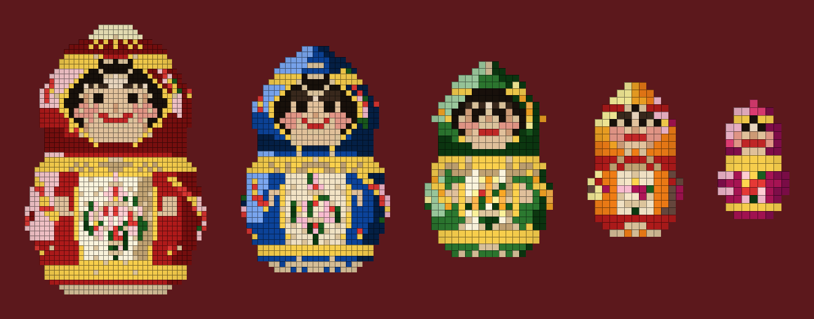

# Матрёшка — voxel nesting dolls

A five-piece Russian matryoshka set built as true voxels. Each doll (except the baby) is hollow, splits at the waist, and is sized so the next one sits inside it.



## The set

| Doll | Russian | Colors | Size (xyz) |
| --- | --- | --- | --- |
| Matryona | Матрёна | scarlet, gold, roses | 37 × 55 × 37 |
| Darya | Дарья | cornflower blue | 27 × 41 × 27 |
| Olga | Ольга | forest green, sunflowers | 19 × 29 × 19 |
| Natasha | Наташа | saffron and berries | 13 × 21 × 13 |
| Masha | Маша | raspberry, solid baby | 9 × 15 × 9 |

Painting follows Semenov / Khokhloma folk colors: red, gold, black, cream, roses and leaves, a scarf window around a round face.

## Open them in the browser

```bash
python3 -m http.server 8000
```

Then open [http://localhost:8000](http://localhost:8000).

- **Click** a closed doll to lift her lid
- **Click** the doll inside to take her out
- **Drag** a doll on the table; drop her onto an open parent to nest her again
- **Open lid** / **Take out** / **Line up** / **Nest all**
- Keys: `O` open, `T` take out, `L` line up, `N` nest all, `1`–`5` select

## MagicaVoxel

`models/` holds MagicaVoxel `.vox` files:

- `matryona.vox`, `darya.vox`, `olga.vox`, `natasha.vox`, `masha.vox` — each doll
- `matryoshka-nested.vox` — the full set stacked inside one another
- `matryoshka-lineup.vox` — all five standing in a row

In MagicaVoxel you can hide layers or split at the waist (`splitY` is also stored in `models/dolls.json`) to lift lids by hand.

## Regenerating

```bash
python3 tools/generate.py
```

Writes `.vox` files, `models/dolls.json` for the viewer, and PNG previews under `previews/`.
