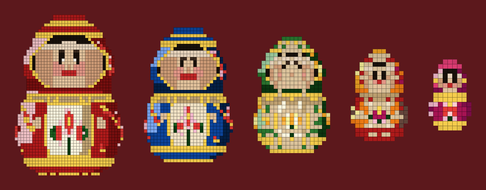
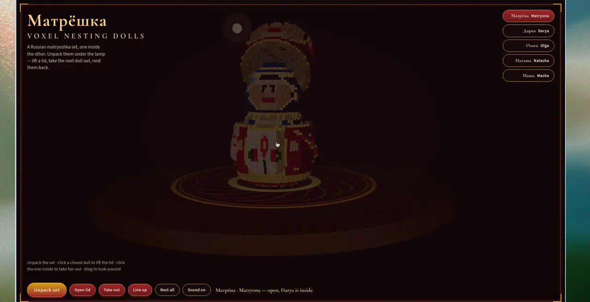
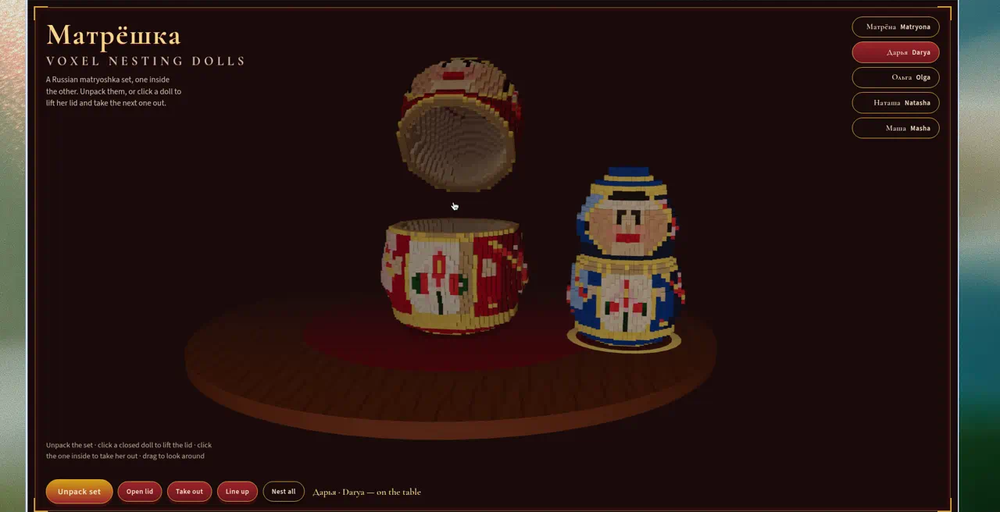
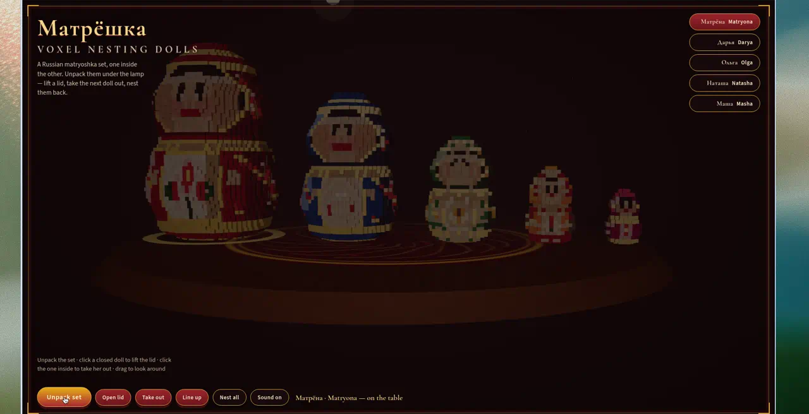

# Матрёшка — voxel nesting dolls

A five-piece Russian matryoshka set built as true voxels. Each doll (except the baby) is hollow, splits at the waist, and is sized so the next one sits inside it.



## The sets

Two families, each five dolls, one inside the other. Switch them in the viewer.

| Doll | Russian | Colors | Size (xyz) |
| --- | --- | --- | --- |
| Matryona | Матрёна | scarlet, gold, roses | 37 × 55 × 37 |
| Darya | Дарья | cornflower blue | 27 × 41 × 27 |
| Olga | Ольга | forest green, sunflowers | 19 × 29 × 19 |
| Natasha | Наташа | saffron and berries | 13 × 21 × 13 |
| Masha | Маша | raspberry, solid baby | 9 × 15 × 9 |

| Doll | Russian | Colors | Size (xyz) |
| --- | --- | --- | --- |
| Ivan | Иван | red kosovorotka, beard, gold sash | 37 × 55 × 37 |
| Pavel | Павел | sea-blue shirt | 27 × 41 × 27 |
| Boris | Борис | green, wheat | 19 × 29 × 19 |
| Yuri | Юрий | amber youth | 13 × 21 × 13 |
| Kolya | Коля | little boy, solid | 9 × 15 × 9 |

Painting follows Semenov / Khokhloma folk colors: red, gold, black, cream, roses and leaves. The sisters wear a scarf window around a round face; the husbands wear a hat, shirt, and sash.

## Open them in the browser

```bash
python3 -m http.server 8000
```

Then open [http://localhost:8000](http://localhost:8000).








The viewer opens on a wide shot of the whole table. The app is bilingual — **RU / EN** in the corner. Pick the **sisters** or the **husbands** (Иван and his sons, nested the same way), and move the table between four rooms: the lamp-lit **izba**, a snowy **winter** yard, a summer **meadow**, and a gilded **terem**.

Each sister has her own temper: Matryona the unhurried matriarch, Darya who skates like frost, Olga who turns to the lamp, Natasha who cannot sit still, and Masha the bouncing baby. Ivan’s line is proud, seafaring, bearish, restless, and tiny.

- **Unpack set** — opens each lid and flies the inner doll out until all five stand in a row and come alive
- **Click** a closed doll to lift her lid; the next one peeks from the cup
- **Click** the inner doll to take her out (she arcs onto the table)
- **Nest all** packs them back, one into the next
- **Drag** a doll onto an open parent to nest her by hand
- Keys: `U` unpack, `N` nest, `O` open, `T` take out, `L` line up, `H` home, `M` mute

## MagicaVoxel

`models/` holds MagicaVoxel `.vox` files:

- `matryona.vox`, `darya.vox`, `olga.vox`, `natasha.vox`, `masha.vox` — the sisters
- `ivan.vox`, `pavel.vox`, `boris.vox`, `yuri.vox`, `kolya.vox` — the husbands
- `matryoshka-nested.vox` / `husbands-nested.vox` — each family stacked inside one another
- `matryoshka-lineup.vox` / `husbands-lineup.vox` — each family standing in a row

In MagicaVoxel you can hide layers or split at the waist (`splitY` is also stored in `models/dolls.json`) to lift lids by hand.

## Regenerating

```bash
python3 tools/generate.py
```

Writes `.vox` files, `models/dolls.json` and `models/husbands.json` for the viewer, and PNG previews under `previews/`.
